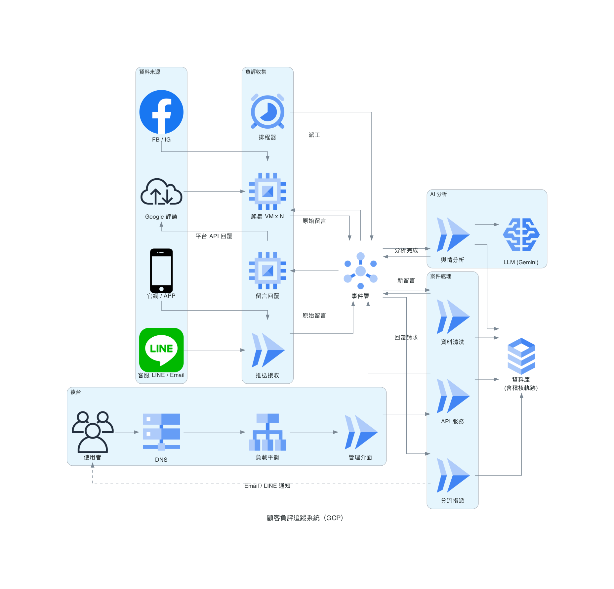
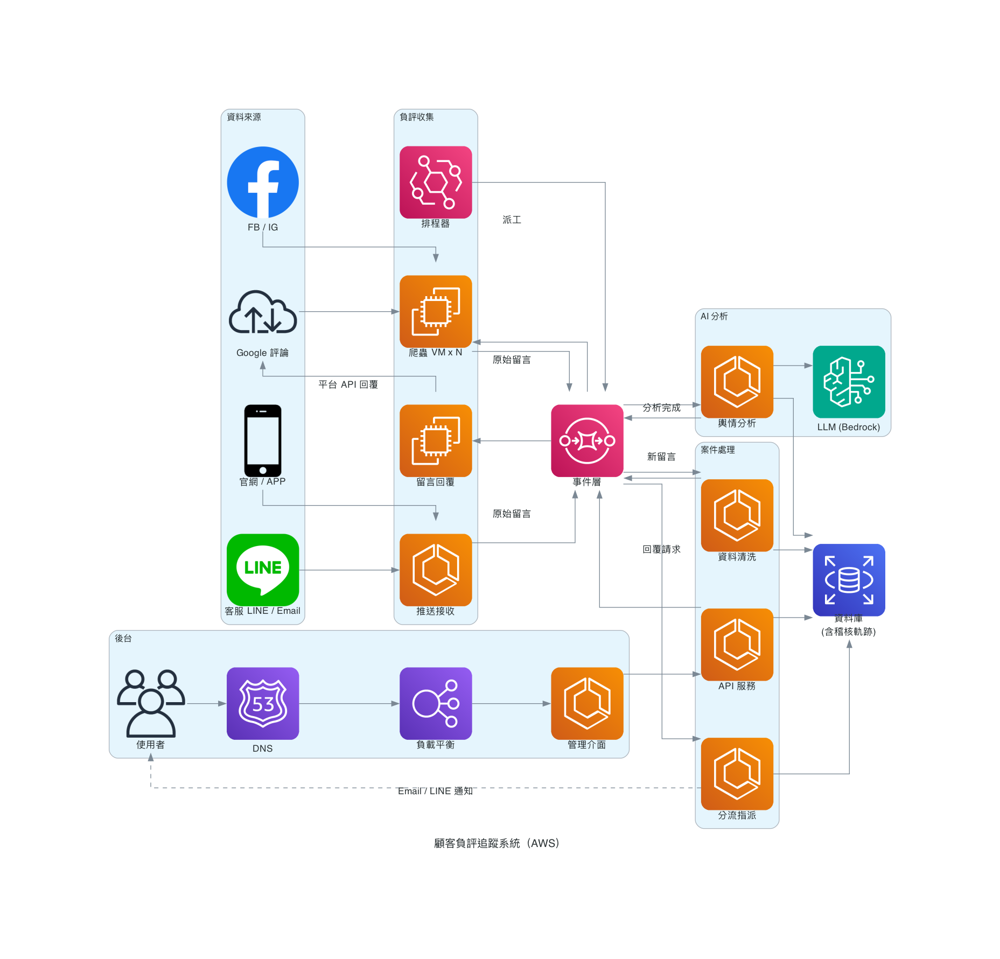

# wachen · 負評哨站

顧客負評追蹤系統 — 從「被動處理」升級為「**主動預警 + 自動分流 + 即時追蹤 + 數據驅動改善**」的完整閉環。

多來源分散式爬蟲把負評抓進來，AI 做情緒/分類/嚴重度分析，規則引擎自動分流指派並算 SLA，後台一站式追蹤處理與回覆。適用**任何連鎖品牌**（多來源、多門市），非綁定單一客戶。

> PoC 狀態：M1–M7 完成，端到端可跑，92 項 E2E 驗收全綠。

---

## 這系統做什麼

```
資料來源              分散式爬蟲            事件管線 (NATS)         AI 分析           分流指派           後台
─────────            ───────────          ──────────────         ────────          ────────          ──────
Google Review ─┐     Scheduler(選主)                             情緒/分類          決策矩陣          收件匣
官網/APP 留言 ─┼──▶  Worker×N ──▶ raw ──▶ review.raw ──▶ Ingestion ──▶ review.created ──▶ Analyzer ──▶ review.analyzed ──▶ Routing ──▶ cases ──▶ 案件詳情
FB/IG(規劃)   ─┤     Webhook Gateway      正規化+版本化           Gemini/heuristic  高/中/低 SLA       AI 進度
客服 Email/LINE┘                                                 高風險字典覆核      指派+通知          回覆審核
                                                                                                       └─ Reply Worker ─▶ 回覆留言
```

每一步都可稽核（誰抓的、AI 用什麼模型/prompt 判的、依哪條規則分流的），全部落 `audit_logs`。

---

## 架構圖

PoC 用 docker-compose 起全棧；上雲時的元件對映如下（兩版拓撲相同）。

### GCP



### AWS



| 元件 | PoC | GCP | AWS |
|---|---|---|---|
| 排程器 | scheduler（Go） | Cloud Scheduler | EventBridge Scheduler |
| 爬蟲 / 留言回覆 | worker / replier | GCE VM | EC2 |
| 其餘服務 | 各 Go/Python 容器 | Cloud Run | ECS Fargate |
| 事件層 | NATS JetStream | Pub/Sub | SQS |
| 資料庫 | PostgreSQL 16 | Cloud SQL | RDS |
| LLM | Gemini API | Vertex AI | Bedrock |
| 對外入口 | Cloudflare Tunnel | Cloud DNS + LB | Route 53 + ELB |

重新產圖：`uv run --with diagrams scripts/architecture_diagram.py`（需 `brew install graphviz`）。

---

## 技術棧

| 層 | 選型 |
|---|---|
| 爬蟲 + 後端服務 | **Go**（scheduler / worker / ingestion / webhook / routing / replier / api） |
| AI 輿情分析 | **Python 3.12**（uv 管理），供應商插件：`GEMINI_API_KEY` → Gemini，未設 → heuristic fallback |
| 資料庫 | **PostgreSQL 16**（完整稽核欄位 + trigger 自動留痕 + append-only 原始資料） |
| 訊息佇列 | **NATS JetStream**（PoC 預設）/ **AWS SQS**（`QUEUE_DRIVER=sqs`，同一套事件語意：重試退避 + DLQ） |
| 後台 | **React + Vite + TypeScript**，**nginx** 出面（靜態 SPA + `/api` 反向代理） |
| 部署 | **docker-compose**（PoC，服務間走內部網路僅後台對外）；**AWS Terraform**（`deploy/aws/`，見下） |

---

## 快速開始

```bash
# 1. 設定環境變數（可留空 → AI 走 heuristic fallback）
cp deploy/.env.example deploy/.env
#   選填 GEMINI_API_KEY 啟用 LLM 分析

# 2. 起全棧（PostgreSQL + NATS + 各服務 + 後台）
make up

# 3. 開後台
open http://localhost:8088
#   預設帳號：admin@example.com / Wachen!2026
```

想要 HTTPS 對外分享 demo：`scripts/tunnel.sh start`（Cloudflare Tunnel）。

### AWS 部署（Terraform，本機免裝 tf）

`deploy/aws/` 一套 code 三環境（`envs/{dev,stg,prod}.tfvars`），對映上方 AWS 架構圖：
ECS Fargate（無狀態服務）+ EC2 Spot（爬蟲）+ SQS（含 DLQ）+ RDS + Route 53/ALB + Bedrock IAM。

```bash
cd deploy/aws
alias tf='docker run --rm -v "$PWD":/work -w /work \
  -e AWS_ACCESS_KEY_ID -e AWS_SECRET_ACCESS_KEY hashicorp/terraform:1.9'
tf init -backend-config="bucket=<state-bucket>" -backend-config="key=wachen/dev.tfstate"
tf apply -var-file=envs/dev.tfvars
```

前置：tfvars 換上自家網域/hosted zone（有 TODO 標記）、image 先推 ECR。
服務的 `QUEUE_DRIVER=sqs` 與各佇列 URL 由 Terraform 自動注入（ecs.tf / ec2.tf），不用手填。

---

## 里程碑

| # | 內容 | 狀態 |
|---|---|---|
| M1 | DB schema + audit trigger + docker-compose | ✅ |
| M2 | 分散式爬蟲 + Google adapter + mock API | ✅ |
| M3 | Ingestion（正規化/版本化）+ Webhook Gateway | ✅ |
| M4 | AI 輿情分析（Gemini + heuristic + 字典覆核） | ✅ |
| M5 | Routing Engine（分流/指派/SLA/通知） | ✅ |
| M6 | 後台介面（登入 + 收件匣 + 篩選 + AI 進度） | ✅ |
| M7 | 回覆留言（草稿 → 高風險審核 → 送出） | ✅ |
| M-R | 真實 Google Business Profile API 驗證 | 規劃中（見 `docs/google-setup.md`） |
| M8 | 壓測 + 正式化（CI/CD、secrets、HA） | 規劃中（見 `TODOS.md`） |

完整架構與設計決策：[`docs/ARCHITECTURE.md`](docs/ARCHITECTURE.md)

---

## 測試

```bash
make test              # Go 單元測試（Docker 內，不需本機 Go）
make test-integration  # Go 整合測試（打真 PostgreSQL）
make test-python       # Python 分析器測試（uv + pytest）
make verify            # E2E 迴歸 M1–M7（tests/e2e/，自給自足、可重複執行）
```

E2E 腳本自建 mock/fixture、測完即砍，**不依賴常駐資料、不留殘留**（見 `tests/e2e/README.md`）。

---

## 專案結構

```
backend/          Go：爬蟲 + 後端服務 + 後台 API（cmd/ 下每個服務一個 binary）
  internal/       adapter（來源插件）/ service（API 業務邏輯）/ store / queue / normalize / bootstrap
analyzer/         Python：AI 分析 worker（pipeline: gemini / heuristic / risk）
admin/            React 後台（nginx + SPA）
migrations/       PostgreSQL migrations（含 audit trigger）
deploy/           docker-compose + .env；aws/ = Terraform（三環境）
scripts/          維運工具（tunnel / cleanup_db / crawl…）
tests/e2e/        端到端迴歸（verify_m1–m7）
docs/             ARCHITECTURE.md / google-setup.md
```

---

## 換一個品牌上線

系統不綁任何特定品牌，新增品牌**不用改程式**：

1. `sources` 加一筆來源（GBP / webhook / 社群），設定該品牌帳號。
2. `stores` 加門市（含 Google location / place ID）。
3. 管線自動接手：爬取 → 分析 → 分流 → 通知 → 後台。

---

## 安全備註（PoC → 正式）

- 預設帳密、`.env` 內的 API key、`app_user` 密碼皆為 **PoC 用**，正式環境改用 secrets 管理。
- 後台目前**僅認證、無 RBAC**（角色已帶在 JWT，M-later 啟用授權）。
- 詳見 `TODOS.md`。
