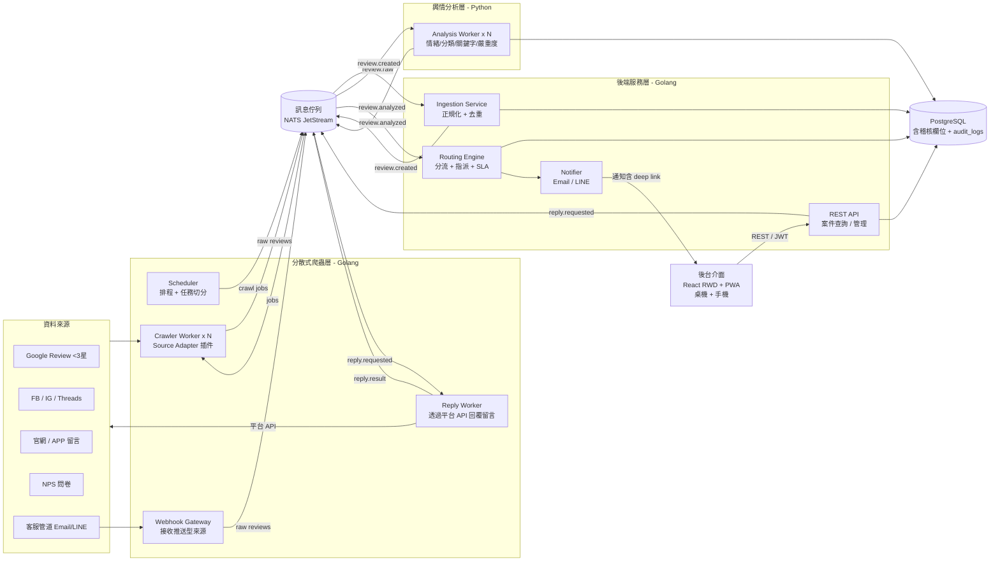
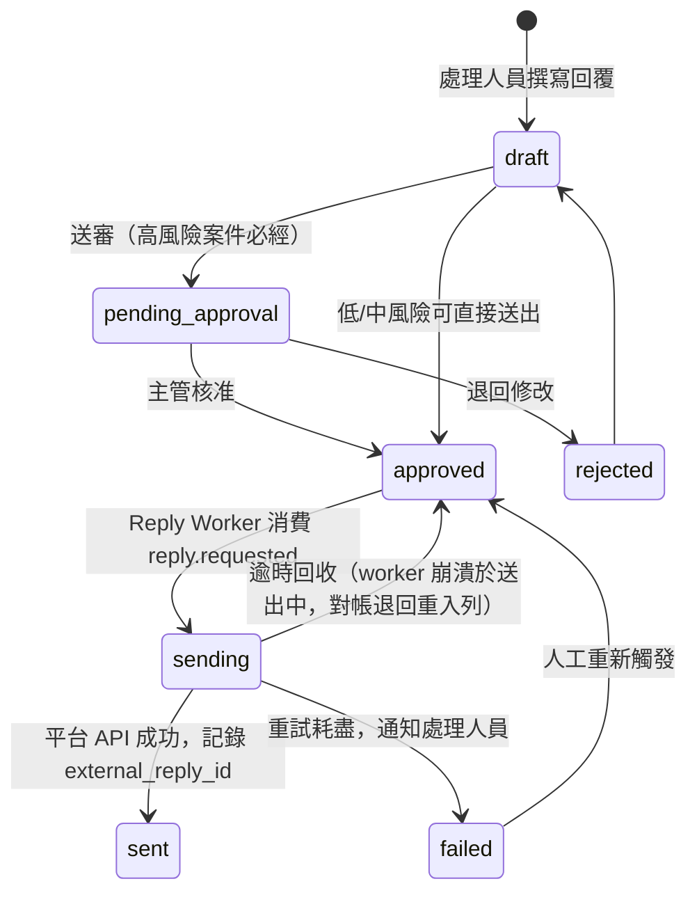
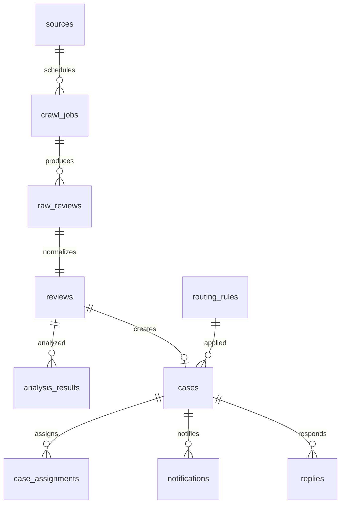

# 顧客負評追蹤系統 PoC — 架構設計（Phase 1-3）

> 範圍：截圖流程的 ①負評自動收集、②自動分析與分類、③自動分流與指派。
> 技術約束：爬蟲與後端 = **Golang**、AI 輿情分析 = **Python**、資料庫 = **PostgreSQL**（完整稽核欄位）、爬蟲採**分散式架構**且**支援多來源**、後台介面 = **React RWD + PWA**（支援手機，見 §8）。

---

## 1. 整體架構



**核心設計原則**

1. **事件驅動、佇列解耦**：爬蟲、分析、分流三段完全透過 MQ 串接，各自獨立擴縮。任何一段掛掉，訊息留在佇列，不丟資料。
2. **Raw 資料永久保留**：爬回來的原始 payload 進 `raw_reviews`（append-only），正規化後才進 `reviews`。分析可重跑、稽核可回溯。
3. **每一步都可追溯**：誰抓的（哪個 worker、哪個 job）、AI 用什麼模型/prompt 版本判的、規則引擎依哪條規則分流的，全部落 DB。

---

## 2. 分散式爬蟲層（Golang）

### 2.1 元件

| 元件 | 職責 |
|---|---|
| **Scheduler** | 讀 `sources` 設定表，依各來源的 cron 排程產生 `crawl_jobs`，推進 MQ。單一 leader（PG advisory lock 選主），避免重複派工 |
| **Crawler Worker** | 無狀態、可水平擴展 N 台。從 MQ 消費 job，透過對應的 Source Adapter 抓取，產出 raw review 推回 MQ |
| **Webhook Gateway** | 推送型來源（LINE webhook、客服 Email 轉入、APP 留言 API）不用爬，直接收進來轉成同格式事件 |

### 2.2 多來源支援 — Source Adapter 介面

```go
type SourceAdapter interface {
    Name() string                    // "google_review", "facebook", ...
    Fetch(ctx context.Context, job CrawlJob) (*FetchResult, error)
}

// FetchResult 除了資料本身，也回報抓取品質訊號（截斷不靜默）
type FetchResult struct {
    Reviews    []RawReview
    Cursor     Cursor // 增量游標（單一 location）
    PageCapHit bool   // 命中分頁安全上限，尾端可能有未抓資料
}

// 支援回覆的來源額外實作此介面（能力用 type assertion 偵測）
type ReplyCapable interface {
    Reply(ctx context.Context, cfg json.RawMessage, req ReplyRequest) (*ReplyResult, error)
}

type RawReview struct {
    SourceName  string
    ExternalID  string          // 來源平台的原始 ID，去重/版本化鍵
    Payload     json.RawMessage // 原始回應，一字不改
    ContentHash string          // 版本鍵：內容變更 = 新版本
    SourceURL   string          // 該店評論頁 deep link（adapter 以 place_id 組出）
    LocationID  string          // 門市歸屬（→ stores）
    FetchedAt   time.Time
}

type ReplyRequest struct {
    ExternalID     string // 要回覆的留言在平台上的 ID
    LocationID     string // 已知歸屬時直接指定，不掃描
    Content        string
    IdempotencyKey string // 防止重複發文
}
```

新增來源 = 實作一個 Adapter + 在 `sources` 表加一筆設定，不動核心程式。**`SourceURL` 為每則留言的必填欄位**：Adapter 抓取時必須組出該則留言的 permalink（Google 用 review 的 share link、FB/IG 用 comment permalink、官網/APP 由 webhook 帶入原頁 URL），儀表板與通知中可一鍵跳回原始留言。

**PoC 來源優先序**：
1. `google_review` — Google Places API（官方、穩定，PoC 首選）
2. `webhook_generic` — 官網/APP 留言、客服管道（推送型，最簡單）
3. `facebook` / `instagram` — Graph API（需粉專權限）
4. `nps_import` — CSV/API 批次匯入
5. `threads` — API 或受控爬取（合規風險最高，PoC 可後放）

### 2.3 分散式關鍵機制

- **任務粒度 = source × location**：500 家連鎖 = 500 個可平行小任務，worker 才能真正分食；單一門市慢/壞只影響自己。
- **工作分配**：靠 MQ consumer group 天然分配，worker 不需互相知道彼此。
- **版本化 + 連續去重**：**只有與「最新版本」內容相同才冪等跳過**（app 層在 advisory lock 下比對）——顧客編輯（3 星改 1 星）是新版本，**回改（A→B→A）也是新版本**，append-only 不變、任何編輯史都不丟失。M3 歸一化取「同 external_id 最新版本」，且只在**正規化內容真的變了**才重觸發分析（商家回覆造成的 payload 變動不算）。
- **孤兒任務回收（reaper）**：worker 崩潰卡 `running`、或派工後 publish 失敗留下孤兒 `pending`，都會讓來源靜默停擺——scheduler leader 每輪 tick 把超時任務改 `failed`，下一輪 cron 自然重排（重抓冪等）。
- **事件不丟失**：`review.raw` publish 失敗 = 任務失敗觸發重試；重試時既有版本列也補發事件（M3 以 raw_review_id 冪等）。
- **防腦裂**：leader 每 tick 在 advisory lock 連線上心跳，PG 斷線即退位重新競選，避免雙 leader 重複派工燒 API 配額。
- **增量抓取**：每個 source 維護 `cursor`（上次抓到的時間戳/page token），存在 `crawl_jobs` 結果中，下次排程接續。
- **速率限制**：每個 Adapter 自帶 rate limiter（token bucket），配置存 `sources.config`。
- **重試**：MQ ack/nack + 指數退避，超過 N 次進 dead-letter，落 `crawl_jobs.status = 'failed'` 供人工檢視。

---

## 3. 訊息佇列選型

| 選項 | 評估 |
|---|---|
| **NATS JetStream（建議）** | Go 原生生態、單一 binary 部署超輕、支援 consumer group / 持久化 / dead-letter，PoC 到中量產都夠用 |
| Kafka | 功能最強但 PoC 運維成本過重 |
| Redis Streams | 最簡單，但持久化與 DLQ 語意較弱 |

**Topic 設計**：

```
crawl.jobs.<source>      Scheduler → Crawler Workers
review.raw               Crawler/Webhook → Ingestion
review.created           Ingestion → Analysis Workers (Python)
review.analyzed          Analysis → Routing Engine
case.created             Routing → Notifier
reply.requested          Backend API → Reply Worker（回覆留言）
reply.result             Reply Worker → Backend（更新回覆狀態）
```

---

## 4. 輿情 AI 分析層（Python）

### 4.1 架構

- **Analysis Worker**：Python 常駐程序（uv 管理套件），消費 `review.created`，分析完寫 DB + 發 `review.analyzed`。可開多個 process/pod 水平擴展（durable consumer 分食）。
- **LLM 供應商插件**：`GEMINI_API_KEY` 有值 → **Gemini**（generateContent + response_schema 結構化輸出，`GEMINI_MODEL` 可換型號）；未設定 → **heuristic** 確定性 fallback（字典比對），開發/CI 端到端可跑。切換供應商 = 換環境變數；input_hash 含模型版本，**新事件**即走新模型，歷史重跑需手動觸發（重發 review.created 或重設 status）。
- **冪等與事件保證**（M3 的教訓直接沿用）：`input_hash = sha256(prompt_version|model|rating|content)`，相同輸入不重算但**仍補發 `review.analyzed`**（堵 publish-loss）；分析寫入有 **FOR UPDATE 版本圍欄**（分析期間被編輯 → 丟棄重讀，舊分析不可能蓋新內容）。兜底範圍誠實聲明：stale-new 掃描只救 `status='new'`，「commit 後 publish 前」的遺失窗口由 **M5 的 analyzed-未建案對帳** 負責（見 §5）。
- 反諷測資（mock 8 則）是 heuristic 與 LLM 的對照 eval：關鍵字比對在「無星等的反諷」上必錯（已文件化為測試），語意理解的價值一翻兩瞪眼。

### 4.2 分析管線（對應截圖 ② 的四項能力）

| 能力 | PoC 做法 |
|---|---|
| 情緒分析 | LLM（Gemini，`GEMINI_API_KEY`）單次呼叫產出結構化 JSON；無 key 時 heuristic fallback |
| 類型分類 | 同上，分類集合：餐點品質/服務態度/出餐速度/環境清潔/價格感受/訂位外送系統問題/其他 |
| 關鍵字辨識 | LLM 抽取 + 高風險關鍵字典（食安、中毒、過敏、提告、媒體…）雙保險 |
| 嚴重度判斷 | LLM 評分 + 規則覆核：命中食安/公關/法律字典 → 強制 `high`，寧可誤升不可漏判 |

一次 LLM 呼叫回傳全部欄位（JSON schema 約束輸出）：

```json
{
  "sentiment": "negative",
  "sentiment_score": -0.87,
  "categories": ["餐點品質", "服務態度"],
  "keywords": ["食物中毒", "態度差"],
  "risk_level": "high",
  "risk_reasons": ["提及食安關鍵字：食物中毒"],
  "summary": "顧客反映用餐後身體不適，且店員處理態度不佳"
}
```

### 4.3 可稽核性（AI 決策也要留痕）

`analysis_results` 每一筆記錄：`model_name`、`model_version`、`prompt_version`、`input_hash`、`raw_response`（LLM 原始輸出）、`latency_ms`。模型或 prompt 換版後可重跑歷史資料比對，且同一則 review 允許多筆分析結果（以 `is_current` 標記現行版本）。

---

## 5. 分流與指派（Golang Routing Engine）

### 5.1 規則驅動

分流規則存 DB（`routing_rules`），不寫死在程式：

| risk_level | 指派對象 | SLA |
|---|---|---|
| high | 總部客服 + 公關/法務 | 2 小時內回應 |
| medium | 區經理 + 店主管 | 24 小時內聯繫 |
| low | 店主管 | 48 小時內處理 |

### 5.2 流程

1. 消費 `review.analyzed` → 依 `risk_level` 查規則 → 建立 `cases`（含 `sla_due_at`）。
2. 建立 `case_assignments`（可多人：高風險 = 客服 + 公關）。
3. 發通知：PoC 先做 **Email + LINE Messaging API push**（注意：LINE Notify 已於 2025-03-31 停止服務，須用官方帳號 + Messaging API，有訊息配額成本），每則通知落 `notifications` 表（狀態：pending/sent/failed，含重試）。
4. **SLA 倒數**：Routing Engine 內建 ticker 掃描 `sla_due_at` 將到期/已逾期的案件，發提醒事件（為 Phase 4 的 SLA 管控預留，PoC 只做提醒不做升級）。

> **M5 必解清單 → 已實作**（決策記錄）：
> 1. **reopen 語意**：保留 `cases.review_id UNIQUE`，一則評論一個案件執行緒。決策矩陣：
>    同 `analysis_id` → Replay（僅補發事件）；開放中風險升 → **Escalated**（換規則、SLA 重算、
>    補指派）；開放中風險未升 → Acknowledged（只收指標）；已結案遇新分析 → **Reopened**
>    （`reopened_count++`、SLA 重算）。歷史全在 audit_logs。
> 2. **事件僅提示**：Routing 只取事件的 `review_id`，一律重讀 `is_current` 分析；
>    冪等鍵 = `cases.analysis_id` 指標；`case.created` 亦僅提示，下游以 (case_id, analysis_id) 去重。
> 3. **analyzed-未建案對帳**：60s 掃描「現行分析未被案件 analysis_id 認領」（涵蓋漏建案
>    與漏升級），每輪上限 20。SLA 逾期提醒每案一次（`sla_reminded_at`），Notifier 以
>    Sender 介面抽換（PoC=log，M-real=SMTP/LINE Messaging API）。

---

## 6. 留言回覆（雙向整合）

處理人員在後端直接回覆原始留言，不用切到各平台後台。回覆是**對外發文**，設計上比讀取嚴格：要審核、要冪等、要全程留痕。

### 6.1 流程與狀態機



1. `POST /api/cases/{id}/replies` 建立回覆草稿 → **高風險案件強制走審核**（公關/法務把關，對應截圖 ③ 的高風險分流），低/中風險依 `routing_rules.require_approval` 設定。
2. 核准後 API 發 `reply.requested`（帶 `idempotency_key`）。
3. **Reply Worker**（部署在爬蟲層，與 Crawler Worker 共用各平台的 Adapter 憑證）以 type assertion 檢查該來源 Adapter 是否 `ReplyCapable`，呼叫平台 API 送出。
4. 成功 → 回寫 `external_reply_id` / `reply_url`，發 `reply.result`；失敗 → 指數退避重試，耗盡進 `failed` 並通知處理人員。
5. **冪等保證**：`replies.idempotency_key` 唯一鍵，隨送出請求帶到平台/callback 供對端去重；`ClaimReplyForSend`（approved→sending 搶占）確保 MQ 重投遞/補發同時只有一個消費者能送。
6. **對帳兜底**（Reply Worker 每 60s，與爬蟲 reaper、Routing 對帳同哲學）：`sending` 逾時（worker 崩潰於 claim 後）退回 `approved` 並重新入列，累計嘗試耗盡轉 `failed`；`approved` 久未消費（API 入列失敗、publish 遺失）補發 `reply.requested`。事件會丟，資料庫狀態是真相。

### 6.2 各來源回覆能力

| 來源 | 回覆方式 | 說明 |
|---|---|---|
| Google Review | Google Business Profile API `reviews.updateReply` | 官方支援，需商家擁有者/管理員授權；一則 review 只有一個商家回覆（更新即覆蓋） |
| Facebook / Instagram | Graph API comment replies | 需粉專 token 與對應權限 |
| Threads | Threads API replies | 權限審核較嚴，PoC 後放 |
| 官網 / APP 留言 | 呼叫自家系統的回覆 API（webhook 反向） | 由 `webhook_generic` adapter 的 config 設定 callback endpoint |
| 客服管道（Email/LINE） | 非「回覆留言」而是「發送訊息」 | 走既有 Notifier 的 Email/LINE 通道，統一記在 `replies` 表 |
| NPS 問卷 | 不支援 | `sources.capabilities` 標記 `can_reply=false`，前端隱藏回覆按鈕 |

`sources.capabilities` (jsonb) 宣告各來源能力（`can_reply`、`reply_max_length`、`reply_editable`…），API 據此決定回覆入口是否開放，前端不用寫死平台邏輯。

### 6.3 稽核重點

`replies` 表每筆記錄：撰寫人、審核人、核准時間、送出內容全文、`external_reply_id`、平台原始回應 — 加上 `audit_logs` trigger 自動記錄每次狀態轉換。對外說了什麼、誰核准的，事後完整可查。

---

## 7. PostgreSQL 資料模型

### 7.1 稽核設計（兩層）

**第一層 — 每張業務表標準稽核欄位**：

```sql
created_at   timestamptz NOT NULL DEFAULT now(),
created_by   text        NOT NULL,   -- 使用者 ID 或服務名 "svc:ingestion"
updated_at   timestamptz NOT NULL DEFAULT now(),
updated_by   text        NOT NULL,
deleted_at   timestamptz,            -- 軟刪除，業務資料不做物理刪除
deleted_by   text,
version      integer     NOT NULL DEFAULT 1   -- 樂觀鎖
```

**第二層 — `audit_logs` 全域異動軌跡（PG trigger 自動寫，繞不過應用層）**：

```sql
CREATE TABLE audit_logs (
    id          bigserial PRIMARY KEY,
    table_name  text        NOT NULL,
    record_id   uuid        NOT NULL,
    action      text        NOT NULL,  -- INSERT / UPDATE / DELETE
    old_data    jsonb,
    new_data    jsonb,
    changed_by  text        NOT NULL,  -- 由 SET LOCAL app.current_actor 帶入
    request_id  text,                  -- 串接全鏈路 trace
    changed_at  timestamptz NOT NULL DEFAULT now()
);
-- append-only：REVOKE UPDATE, DELETE ON audit_logs FROM app_user;
```

應用層每個交易開頭 `SET LOCAL app.current_actor / app.request_id`，trigger 讀取寫入，保證任何異動都有「誰、何時、改了什麼」。

### 7.2 核心資料表



| 表 | 重點欄位 | 說明 |
|---|---|---|
| `sources` | name, adapter, config(jsonb), capabilities(jsonb), schedule_cron, enabled | 來源設定 + 能力宣告（can_reply 等），新增來源不改程式 |
| `crawl_jobs` | source_id, **location_id**, status, cursor_state(jsonb), worker_id, started_at, finished_at, error, stats(jsonb) | 每次抓取任務全記錄 — 爬蟲側稽核；粒度 = source × location，stats 含 page_cap_hit 截斷標記 |
| `stores` | name, google_location_id(UNIQUE), google_place_id | location→門市對映；分流指派、收件匣篩選、source_url deep link 都靠它 |
| `raw_reviews` | source_name, external_id, payload(jsonb), content_hash, source_url, location_id, fetched_at, crawl_job_id | **append-only 原始資料**，連續去重（app 層）——編輯與回改都是新版本列 |
| `ingest_quarantine` | raw_review_id(PK), reason | normalize 失敗的毒藥 raw 隔離區；人工修復後刪列即重入對帳掃描 |
| `reviews` | raw_review_id, author, rating, content, posted_at, store_id, status, **source_url** | 正規化統一格式；source_url = 該則留言 permalink，一鍵跳回原頁 |
| `analysis_results` | review_id, sentiment, sentiment_score, categories, keywords, risk_level, model_name, model_version, prompt_version, raw_response, is_current | AI 判斷 + 完整模型溯源，允許多版本 |
| `cases` | review_id, risk_level, rule_id, status, sla_due_at, responded_at | 案件主體 |
| `case_assignments` | case_id, assignee_role, assignee_id, assigned_at | 一案多指派 |
| `replies` | case_id, review_id, content, status, idempotency_key(UNIQUE), author_id, approved_by, approved_at, external_reply_id, reply_url, platform_response(jsonb), retry_count, error | 回覆留言全紀錄（狀態機見 §6.1），對外內容 + 審核鏈完整留痕 |
| `notifications` | case_id, channel, recipient, status, sent_at, retry_count, error | 通知也留痕 |
| `routing_rules` | risk_level, assignee_roles, sla_hours, require_approval, priority, enabled | 分流規則 + 回覆是否需審核，可調不用改 code |
| `audit_logs` | （見上） | 全域異動軌跡 |

---

## 8. 後台介面（Web Admin，支援手機）

### 8.1 選型：React RWD + PWA，而非 React Native

| 考量 | RWD Web + PWA（建議） | React Native |
|---|---|---|
| 程式碼 | 一套，桌機 + 手機瀏覽器全吃 | Web 版仍要另做（或用 Expo Web，但後台表格體驗差） |
| 上線速度 | 部署即生效，無審核 | App Store / Play 審核，PoC 迭代嚴重拖慢 |
| 後台特性 | 案件列表、篩選、儀表板、稽核檢視都是**表格重型介面**，Web 是主場 | RN 做複雜表格/儀表板事倍功半 |
| 通知進入點 | 既有 **Email/LINE 通知帶 deep link**，點了直接開網頁到案件頁，不用裝 App | 原生推播是唯一明顯優勢 |
| 安裝體驗 | PWA 可加到主畫面、近似原生 | 原生 |

截圖裡的行動場景是**店主管在手機/平板上填處理回報表**（Phase 4）——這是表單操作，手機瀏覽器完全能勝任；總部端則以桌機儀表板為主。PoC 的通知鏈路已經是 LINE/Email，「點通知 → 開網頁 → 處理案件」比「先裝 App」的導入摩擦低得多。

**何時才值得上 React Native**：需要原生推播（取代 LINE）、離線操作、或大量相機/掃碼流程時。屆時後端不用動——API 本來就是 JSON REST，用 **Expo 另起 App 專案共用同一套 API** 即可，這條路徑已預留。

### 8.2 技術棧與頁面

- **React + TypeScript + Vite**、Tailwind CSS、shadcn/ui（或 Ant Design，表格元件成熟）、TanStack Query。
- **RWD 斷點策略**：手機版以「案件收件匣 + 案件處理」為核心動線；儀表板/管理頁在手機上簡化為卡片檢視。

PoC 頁面（對應 Phase 1-3 + 回覆）：

| 頁面 | 功能 | 主要使用者 |
|---|---|---|
| 案件收件匣 | 依風險等級/SLA 剩餘時間排序、篩選（來源/分類/門市） | 全部 |
| 案件詳情 | 留言原文 + **source_url 一鍵跳原頁** + AI 分析結果（情緒/分類/關鍵字/風險理由）+ 處理紀錄 | 全部 |
| 回覆撰寫 | 撰寫回覆 → 送審/送出（依 §6 狀態機），顯示各來源 can_reply 能力 | 店主管/客服 |
| 審核佇列 | 待核准回覆列表、核准/退回 | 公關/法務/主管 |
| 來源管理 | sources 啟停、排程、抓取狀態（crawl_jobs 健康度） | 管理員 |
| 簡版儀表板 | 今日負評數、風險分布、SLA 逾期數 | 總部 |

### 8.3 認證與稽核

- 後端 API 發 **JWT**，RBAC 角色對齊分流設計：`店主管 / 區經理 / 總部客服 / 公關法務 / 管理員`，`routing_rules.assignee_roles` 直接引用同一組角色。
- UI 所有寫入動作都走 API → 交易內 `SET LOCAL app.current_actor = <user_id>` → `audit_logs` 自動記錄，前端無任何繞過稽核的路徑。
- LINE/Email 通知內的 deep link 格式：`https://<host>/cases/{id}`，未登入導向登入後回跳。

---

## 9. 專案結構與部署

```
poc-wachen/
├── backend/                  # Go：scheduler + workers + webhook gateway + reply worker
│   ├── cmd/{scheduler,worker,webhook,replier}/
│   └── internal/adapter/     # google/, facebook/, webhook/, nps/（Fetch + Reply 同居一處，共用憑證）
├── backend/                  # Go：ingestion + routing + API + notifier
│   ├── cmd/{ingestion,routing,api}/
│   └── internal/{store,rules,notify}/
├── analyzer/                 # Python：analysis worker + FastAPI
│   ├── worker.py
│   ├── pipeline/             # sentiment / classify / keywords / severity
│   └── prompts/              # 版本化 prompt 檔
├── admin/                    # React + TS + Vite：後台介面（RWD + PWA）
│   └── src/{pages,components,api}/
├── migrations/               # SQL migrations（含 audit trigger）
├── deploy/docker-compose.yml # PG + NATS + 各服務，一鍵起 PoC
└── docs/ARCHITECTURE.md
```

**PoC 部署**：`docker-compose` 起 PostgreSQL 16、NATS JetStream、各 Go/Python 服務。分散式能力以「同一 worker 服務跑 2+ replicas」驗證。正式環境路徑：K8s + HPA（依佇列深度擴縮）。

**網路邊界**：服務間一律走內部網路（NATS 事件 + PostgreSQL），**不對外暴露任何 port**（Adminer 為本機 debug UI 例外）。正式環境唯一需要 ingress 的是 **Webhook Gateway**（接收外部系統推送）。服務間沒有同步 RPC——不需要 gRPC，事件驅動見 §1 設計原則。

**可觀測性（PoC 最低限度）**：結構化日誌（zerolog / structlog）全鏈路帶 `request_id`；每個 stage 落 DB 的時間戳即可拉出「收集→分析→分流」端到端延遲。

---

## 10. PoC 驗證目標與里程碑

| # | 里程碑 | 驗證點 |
|---|---|---|
| M1 | DB schema + audit trigger + docker-compose 骨架 | 任何寫入都自動產生 audit_logs |
| M2 | Google Review adapter + Scheduler + 2 個 worker | 分散式抓取、去重、增量 cursor 有效；每則留言帶可點擊的 source_url |
| M3 | **Ingestion Service**（review.raw → 正規化 → reviews → review.created，含 store_id 填入與版本歸一）+ Webhook Gateway（模擬官網留言/客服） | 第二種來源型態（推送）打通；M4 依賴的 review.created 在此產生 |
| M4 | Python 分析 worker（LLM 管線） | 情緒/分類/關鍵字/嚴重度四項輸出 + 模型溯源落庫 |
| M5 | Routing Engine + Email/LINE 通知 | 高風險案件從「**review.raw 事件**」到「通知送達」端到端 < 5 分鐘（偵測延遲由來源輪詢週期決定、可配置，另計） |
| **M-R** | **真實 API 驗證（平行軌道）**：GBP 審核通過後，對一家真門市拉真評論 + 發一次真回覆 | **PoC 唯一真正不確定的事**——v4 API 已標棄用、審核要數週；不擋 M3/M4 開發，但 M7/M8 驗收以此為前置 |
| M6 | 後台介面：收件匣 + 案件詳情 + 登入/RBAC | 手機瀏覽器完成「點 LINE 通知 → 開案件 → 檢視 AI 分析 → 跳原始留言」全流程 |
| M7 | 回覆留言：回覆撰寫/審核 UI + Reply Worker | 從後台回覆 Google Review 成功、冪等（MQ 重投不重複發文）、審核鏈落 audit_logs |
| M8 | 端到端 demo + 壓測（模擬 1000 則/小時） | worker 水平擴展有效、無資料遺失 |

**已知風險**：
- 社群平台（FB/IG/Threads）API 權限與反爬限制是最大外部依賴，PoC 建議先用 Google Review + Webhook 兩種來源證明架構，社群來源在 M8 後補。
- 回覆功能依賴各平台的**寫入權限**，比讀取權限門檻更高：Google 需 Business Profile 商家管理員授權（且一則 review 僅一個商家回覆、更新即覆蓋），FB/IG 需通過 App Review 取得發文權限。PoC 建議先以 Google Review 驗證回覆鏈路。
